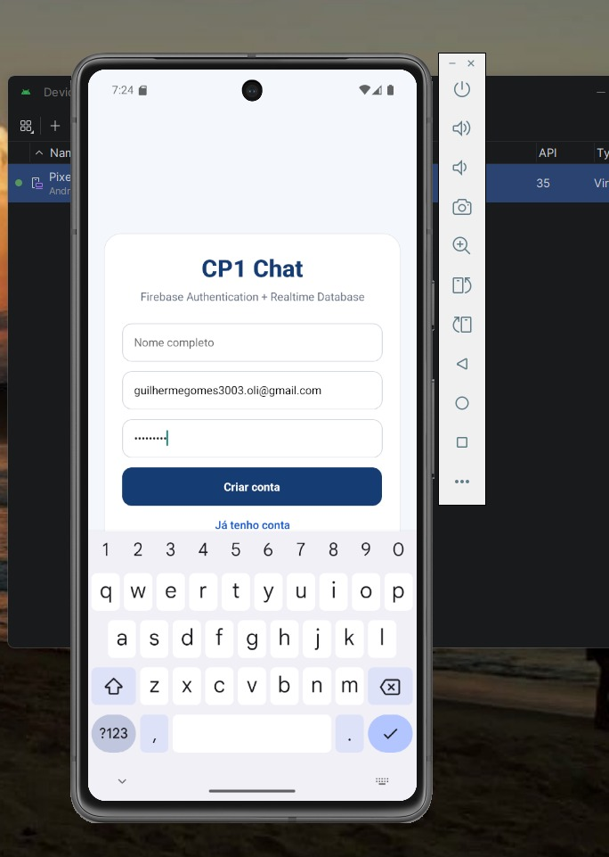
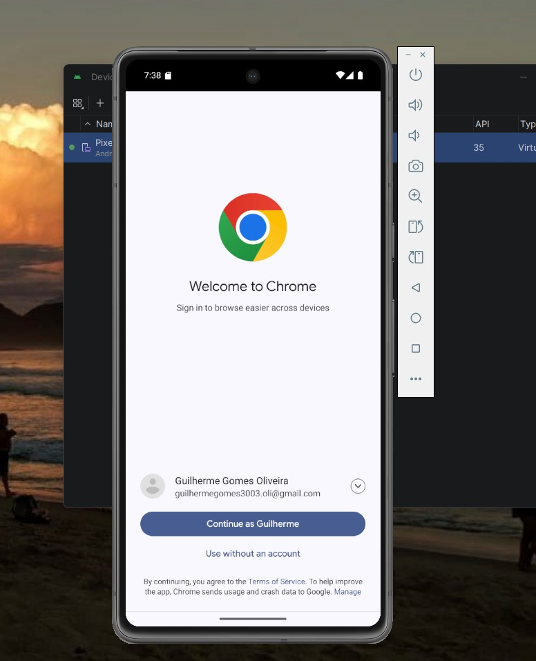
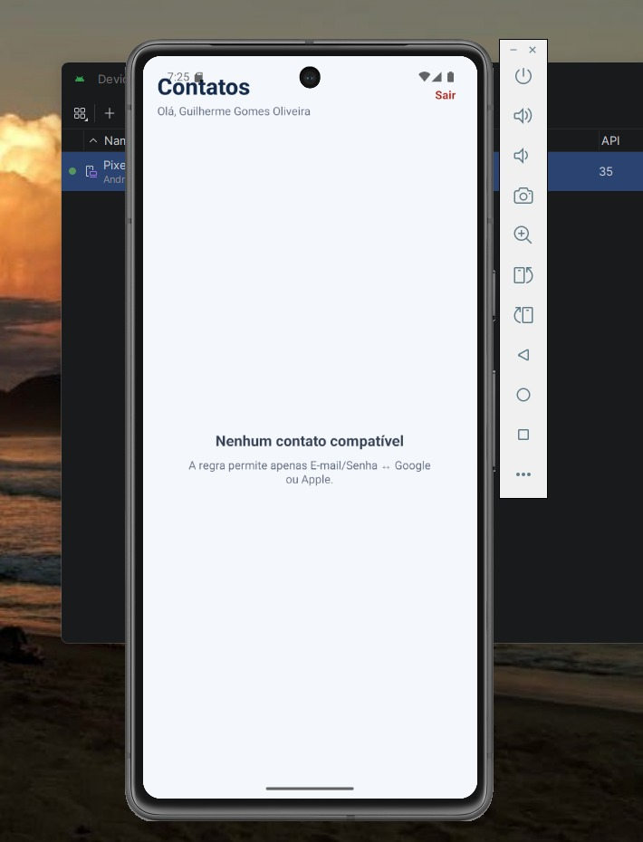

# CP1 - React Native Chat com Firebase

Aplicativo de chat **1 para 1** desenvolvido em React Native + TypeScript com Expo SDK 55, Firebase Authentication e Firebase Realtime Database.

## Integrante

- **RM554606 - Guilherme Gomes Oliveira**

## Objetivo do projeto

O projeto implementa um app mobile de chat com autenticacao de usuarios, cadastro de perfis no Realtime Database e troca de mensagens em tempo real. A regra central do trabalho e permitir conversas apenas entre usuarios de provedores diferentes em uma combinacao especifica:

- E-mail/Senha pode conversar com Google.
- E-mail/Senha pode conversar com Apple.
- E-mail/Senha nao conversa com E-mail/Senha.
- Google nao conversa com Google.
- Apple nao conversa com Apple.
- Google nao conversa com Apple.

## Requisitos implementados

- React Native + Expo SDK 55 + TypeScript estrito.
- Firebase Authentication com E-mail/Senha, Google e Apple.
- Firebase Realtime Database para usuarios, conversas e mensagens.
- Chat exclusivamente entre duas pessoas.
- Regra de compatibilidade aplicada antes da abertura do chat.
- Bloqueio de combinacoes nao permitidas pelas regras do app e pelas regras do banco.
- Atualizacao de mensagens em tempo real usando `onValue`.
- Remocao correta dos listeners ao sair da tela.
- Loading, erros, estado sem contatos e estado sem mensagens.
- Uso de `useState`, `useEffect`, `useMemo` e `useCallback`.
- Separacao em components, contexts, hooks, services, types e utils.
- Codigo sem uso de `any`.
- Regras de seguranca do Realtime Database versionadas em `firebase/database.rules.json`.

## Tecnologias

- Expo SDK 55
- React Native 0.83
- React 19.2
- TypeScript
- Firebase Authentication
- Firebase Realtime Database
- Expo AuthSession
- Expo Apple Authentication
- Expo Crypto

## Estrutura do projeto

```text
App.tsx
src/
  components/
  contexts/
  hooks/
  screens/
  services/
  types/
  utils/
firebase/
  database.rules.json
docs/
  screenshots/
android/
```

### Principais responsabilidades

| Caminho | Responsabilidade |
|---|---|
| `App.tsx` | Envolve o app com `AuthProvider`, `SafeAreaView` e `StatusBar`. |
| `src/components/AppContent.tsx` | Decide qual tela exibir: login, lista de usuarios ou chat. |
| `src/contexts/AuthContext.tsx` | Mantem o usuario logado, loading inicial e restauracao de sessao via Firebase Auth. |
| `src/screens/LoginScreen.tsx` | Tela de login/cadastro com E-mail/Senha, Google e Apple. |
| `src/screens/UsersScreen.tsx` | Lista usuarios compativeis e mostra estado vazio quando nao ha contato valido. |
| `src/screens/ChatScreen.tsx` | Exibe mensagens, campo de envio e cabecalho da conversa. |
| `src/hooks/useAuth.ts` | Facilita o consumo do contexto de autenticacao. |
| `src/hooks/useChat.ts` | Abre/cria conversa, assina mensagens em tempo real e envia mensagens. |
| `src/services/firebase.ts` | Inicializa Firebase App, Auth e Realtime Database. |
| `src/services/authService.ts` | Centraliza cadastro, login, Google Sign-In, Apple Sign-In e logout. |
| `src/services/userService.ts` | Salva perfil, busca perfil e assina a lista de usuarios. |
| `src/services/chatService.ts` | Cria conversas, envia mensagens e assina mensagens por conversa. |
| `src/utils/chatRules.ts` | Implementa a regra de compatibilidade entre provedores. |
| `firebase/database.rules.json` | Define regras de leitura, escrita e validacao no Realtime Database. |

## Analise detalhada do codigo

### Fluxo de inicializacao

O arquivo `App.tsx` e o ponto de entrada da aplicacao. Ele envolve todo o app com `AuthProvider`, permitindo que qualquer tela acesse o usuario autenticado. A tela real exibida e controlada por `AppContent`.

`AppContent` consulta `useAuth()` e segue tres caminhos:

1. Enquanto a sessao esta sendo restaurada, mostra `Loading`.
2. Se nao existe usuario autenticado, mostra `LoginScreen`.
3. Se existe usuario e nenhum contato foi escolhido, mostra `UsersScreen`.
4. Se existe usuario e um contato foi escolhido, mostra `ChatScreen`.

Esse fluxo deixa a navegacao simples e evita depender de uma biblioteca externa de rotas para um app pequeno.

### Autenticacao

`AuthContext.tsx` usa `onAuthStateChanged` do Firebase Auth para acompanhar login, logout e restauracao de sessao. Quando o Firebase informa que existe um usuario logado, o app busca o perfil salvo em `users/{uid}` no Realtime Database usando `getUserProfile`.

`authService.ts` implementa os provedores:

- `registerWithEmail`: cria usuario com e-mail/senha, atualiza o `displayName`, monta o perfil `ChatUser` e salva no banco.
- `loginWithEmail`: autentica com e-mail/senha e salva/atualiza o perfil do usuario no banco.
- `loginWithGoogleIdToken`: recebe o `id_token` do Google, cria credencial Firebase e salva o perfil com provider `google`.
- `loginWithApple`: gera nonce, abre o Apple Sign-In, valida o token com Firebase e salva o perfil com provider `apple`.
- `logout`: encerra a sessao no Firebase Auth.

O tipo `AuthProviderType` aceita apenas `password`, `google` ou `apple`, o que reduz erro de string solta no restante do app.

### Regra de compatibilidade

A regra principal fica em `src/utils/chatRules.ts`.

```ts
export const canProvidersChat = (first: AuthProviderType, second: AuthProviderType): boolean => {
  const firstIsPassword = first === 'password';
  const secondIsPassword = second === 'password';
  return firstIsPassword !== secondIsPassword && !(first !== 'password' && second !== 'password');
};
```

Na pratica, a funcao so retorna `true` quando exatamente um dos usuarios e `password` e o outro e um provedor social permitido (`google` ou `apple`). A funcao `isCompatibleUser` tambem impede que o usuario converse com ele mesmo.

`UsersScreen.tsx` usa `useMemo` para filtrar a lista completa de usuarios e renderizar apenas os contatos compativeis. Se nao houver nenhum, a tela exibe "Nenhum contato compativel", mostrando que a regra foi aplicada.

### Conversas e mensagens

`chatService.ts` trabalha com tres estruturas no Realtime Database:

```text
users/{uid}
conversations/{conversationId}
messages/{conversationId}/{messageId}
```

O `conversationId` e gerado por `buildConversationId(uidA, uidB)`, ordenando os dois UIDs e juntando com `__`. Isso garante que a conversa entre duas pessoas tenha sempre o mesmo identificador, independentemente de quem abriu o chat primeiro.

`getOrCreateConversation` verifica se a conversa ja existe. Se existir, retorna os dados. Se nao existir, cria uma conversa com dois participantes e `createdAt`.

`sendMessage` remove espacos extras, ignora mensagens vazias, cria um novo ID com `push` e salva `senderId`, `receiverId`, `text` e `createdAt`.

`subscribeToMessages` usa `onValue` para receber atualizacoes em tempo real. As mensagens sao transformadas de objeto para array, recebem `id` e `conversationId`, e sao ordenadas por `createdAt`.

### Hook de chat

`useChat.ts` concentra a logica da tela de conversa:

- abre ou cria a conversa;
- salva o `conversationId`;
- cria o listener de mensagens;
- remove o listener no cleanup do `useEffect`;
- controla loading, envio e erros;
- disponibiliza a funcao `send`.

O uso da flag `active` evita atualizar estado depois que a tela desmonta, o que ajuda a prevenir warnings e efeitos colaterais.

### Telas e componentes

`LoginScreen.tsx` contem os campos de cadastro/login, botoes de provedores e tratamento de erro. O botao Apple aparece apenas no iOS quando `AppleAuthentication.isAvailableAsync()` confirma suporte.

`UsersScreen.tsx` assina a lista de usuarios pelo `userService`, filtra os compativeis e permite logout. Quando nao existe contato valido, mostra um estado vazio claro.

`ChatScreen.tsx` renderiza a conversa selecionada. Ela rola automaticamente para o fim quando novas mensagens chegam e usa `ChatInput` para envio.

Os componentes menores (`Loading`, `ErrorMessage`, `UserItem`, `ChatMessage`, `ChatInput`) deixam as telas mais legiveis e reaproveitaveis.

### Regras de seguranca do Firebase

O arquivo `firebase/database.rules.json` reforca no banco as principais restricoes:

- usuarios autenticados podem ler `users`;
- cada usuario so pode escrever o proprio perfil;
- o provider salvo no perfil precisa bater com o provider real do token Firebase;
- conversas so podem ser criadas por um participante;
- conversas so podem ser criadas quando a combinacao de provedores e valida;
- mensagens so podem ser lidas pelos participantes da conversa;
- mensagens so podem ser criadas pelo remetente autenticado;
- o destinatario precisa ser o outro participante da conversa;
- texto da mensagem precisa ter entre 1 e 1000 caracteres.

Isso e importante porque a regra de compatibilidade nao fica apenas na interface. Mesmo que alguem tente escrever diretamente no banco, as regras reduzem o risco de conversas invalidas.

## Firebase

Projeto configurado: `cp-1-mobile`.

```text
users/{uid}
conversations/{conversationId}
messages/{conversationId}/{messageId}
```

Os arquivos de configuracao versionados sao:

- `google-services.json` para Android/raiz do projeto.
- `android/app/google-services.json` para o projeto nativo Android.
- `GoogleService-Info.plist` para iOS.
- `src/services/firebase.ts` para configuracao usada pelo SDK Web do Firebase dentro do app Expo/React Native.

## Regra de comunicacao

| Usuario A | Usuario B | Permitido |
|---|---|---|
| E-mail/Senha | Google | Sim |
| E-mail/Senha | Apple | Sim |
| E-mail/Senha | E-mail/Senha | sim |
| Google | Google | Sim |
| Apple | Apple | Nao |
| Google | Apple | Nao |

## Como rodar o projeto

### 1. Pre-requisitos

Instale antes de rodar:

- Node.js 20.19 ou superior.
- npm.
- Git.
- Android Studio, caso queira rodar no emulador Android.
- Um emulador Android criado pelo Android Studio ou um celular Android com depuracao USB.
- Xcode em macOS, caso queira rodar no iOS.

Para conferir as versoes:

```bash
node -v
npm -v
git --version
```

No Windows PowerShell, se `npm run ...` for bloqueado por politica de execucao, use `npm.cmd run ...`.

### 2. Baixar o repositorio

```bash
git clone https://github.com/Guig3003/CheckPoint-1---REACT_NATIVE_CHAT_FIREBASE.git
cd CheckPoint-1---REACT_NATIVE_CHAT_FIREBASE
```

Se voce ja estiver com a pasta do projeto aberta, basta entrar no diretorio do projeto.

### 3. Instalar dependencias

```bash
npm install
```

Depois, confira se as dependencias Expo estao alinhadas com a versao do SDK:

```bash
npx expo install --fix
```

### 4. Validar TypeScript

```bash
npm run typecheck
```

No Windows PowerShell, se necessario:

```bash
npm.cmd run typecheck
```

Nesta revisao, o comando `npm.cmd run typecheck` foi executado com sucesso.

### 5. Rodar com Expo

```bash
npm start
```

ou, no Windows PowerShell:

```bash
npm.cmd start
```

Esse comando abre o Metro/Expo Dev Server. A partir dele, voce pode escolher:

- abrir no Android;
- abrir no iOS, se estiver no macOS;
- abrir no navegador;
- escanear o QR Code com o Expo Go, quando o fluxo for compativel.

### 6. Rodar no Android nativo

Como o projeto ja possui a pasta `android/`, use:

```bash
npm run android
```

ou:

```bash
npm.cmd run android
```

Antes de executar, deixe um emulador Android aberto pelo Android Studio ou conecte um aparelho fisico com depuracao USB habilitada.

Para listar dispositivos Android conectados:

```bash
adb devices
```

Se o app nao abrir na primeira tentativa, confirme que:

- o emulador terminou de iniciar;
- o dispositivo aparece em `adb devices`;
- as dependencias foram instaladas com `npm install`;
- o Metro esta rodando ou pode ser iniciado pelo comando do Expo.

### 7. Rodar no iOS

O iOS exige macOS com Xcode instalado.

```bash
npm run ios
```

ou:

```bash
npm.cmd run ios
```

O login Apple so aparece em iOS quando o recurso esta disponivel. Em builds assinadas, a capability **Sign in with Apple** precisa estar habilitada na conta Apple Developer/EAS.

### 8. Rodar no navegador

```bash
npm run web
```

ou:

```bash
npm.cmd run web
```

O foco da entrega e mobile. A versao web pode ajudar em testes rapidos de interface, mas recursos nativos como Apple Sign-In dependem da plataforma.

### 9. Publicar regras do Realtime Database

As regras estao em `firebase/database.rules.json`. Para publicar, e necessario estar logado no Firebase CLI e ter acesso ao projeto `cp-1-mobile`.

```bash
npm install -g firebase-tools
firebase login
firebase use cp-1-mobile
firebase deploy --only database
```

Se as regras ja estiverem publicadas no projeto Firebase, nao e necessario repetir este passo para apenas rodar o app.

## Problemas comuns

| Problema | Como resolver |
|---|---|
| `npm.ps1 nao pode ser carregado` | Use `npm.cmd run typecheck`, `npm.cmd start` ou `npm.cmd run android` no PowerShell. |
| Emulador nao aparece | Abra o Android Studio, inicie o emulador e confira com `adb devices`. |
| Google Sign-In falha no Android | Confira o `google-services.json`, o package `com.guig3003.cp1chatfirebase` e o SHA-1 cadastrado no Firebase. |
| Apple nao aparece | O botao Apple so aparece no iOS quando `expo-apple-authentication` indica disponibilidade. |
| Nenhum contato compativel | Cadastre/logue outro usuario com provider permitido pela regra. Um usuario E-mail/Senha precisa de contato Google ou Apple. |
| Mensagem nao envia | Verifique se a conversa existe, se os usuarios sao participantes e se as regras do Realtime Database foram publicadas. |

## Prints da aplicacao

Os prints abaixo demonstram o resultado final executado no emulador Android e validam os principais requisitos da entrega.

### Cadastro com E-mail/Senha



A tela de autenticacao permite criar conta usando nome, e-mail e senha. Esse fluxo atende ao requisito de Firebase Authentication com E-mail/Senha e prepara o usuario para ser registrado no Realtime Database.

### Login com Google



O fluxo de login social abre a autenticacao do Google no navegador do Android. Esse print evidencia a integracao com provedor Google, conforme solicitado nos requisitos de autenticacao.

### Lista de contatos compativeis



A tela de contatos mostra o usuario autenticado e informa que nao ha contato compativel no momento. O resultado esta correto porque a regra do app permite conversa apenas entre contas E-mail/Senha e Google ou Apple. Quando nao existe outro usuario com provedor compativel cadastrado no banco, a aplicacao exibe o estado vazio em vez de liberar conversas invalidas.

## Resultado conforme os requisitos

O projeto entrega um chat 1 para 1 com autenticacao pelo Firebase e persistencia no Firebase Realtime Database. A regra de comunicacao foi aplicada para que usuarios so consigam conversar quando a combinacao de provedores for valida: E-mail/Senha com Google ou E-mail/Senha com Apple.

Na execucao mostrada pelos prints, o cadastro por E-mail/Senha funciona, o fluxo de Google Sign-In e iniciado corretamente e a listagem de contatos respeita a regra de compatibilidade. Como nao havia contato Google ou Apple disponivel para o usuario E-mail/Senha logado, o aplicativo exibiu o estado "Nenhum contato compativel", demonstrando o bloqueio das combinacoes nao permitidas.

## Seguranca

As regras de producao estao em `firebase/database.rules.json`. Nao utilize regras globais abertas (`.read: true` / `.write: true`).

## Entrega

Repositorio destinado a entrega do **CheckPoint 1 - Chat** via Microsoft Teams.
